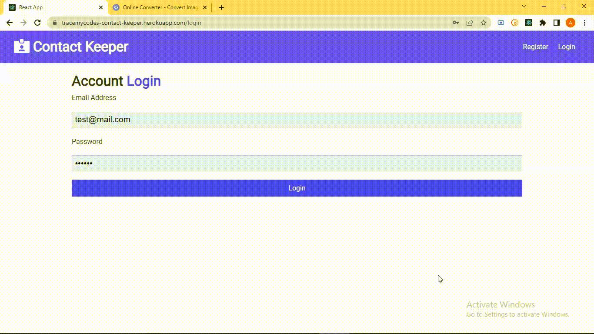

# Full-stack contact saver application

- A Full-stack web application that provides a Database that save's all of your professional and personal contact information, with CRUD functionality and responsive design.

**Link to project:** https://github.com/tracemycodes/fullstack_contact_keeper_webapp

## How It's Made:

**Tech used:** ReactJs, Style-components, Context-API, Axios, NodeJs Express MongoDB.

This application is made using MERN stack (MongoDb, Express, React, Node), MongoDB Atlas is the No-SQL cloud Database used to saved the added contact information.

users are able to:

- Sign up and create an phone book contact account
- Sign into their unique account with login details
- Add a contact to their book
- Users should be able to edit and update a particular contact
- Delete any contact of choice
- Log out of their account
- Login and access previously saved contacts.

## Optimizations

_(optional)_

Future optimizations which can be included to this application includes but not limited to.

- Providing option to save various numbers of a unique contact.

## Lessons Learned:

In this project i Practiced and learned about Data Modelling, CD/CI command line tools, Handling the server request and response cycle.

<!-- ## Examples:
Take a look at these couple examples that I have in my own portfolio:

**Palettable:** https://github.com/alecortega/palettable

**Twitter Battle:** https://github.com/alecortega/twitter-battle

**Patch Panel:** https://github.com/alecortega/patch-panel
 -->

# Getting Started with Create React App

This project was bootstrapped with [Create React App](https://github.com/facebook/create-react-app).

## Available Scripts

In the project directory, you can run:

### `npm start`

Runs the app in the development mode.\
Open [http://localhost:3000](http://localhost:3000) to view it in your browser.

The page will reload when you make changes.\
You may also see any lint errors in the console.

### `npm test`

Launches the test runner in the interactive watch mode.\
See the section about [running tests](https://facebook.github.io/create-react-app/docs/running-tests) for more information.

### `npm run build`

Builds the app for production to the `build` folder.\
It correctly bundles React in production mode and optimizes the build for the best performance.

The build is minified and the filenames include the hashes.\
Your app is ready to be deployed!

See the section about [deployment](https://facebook.github.io/create-react-app/docs/deployment) for more information.
